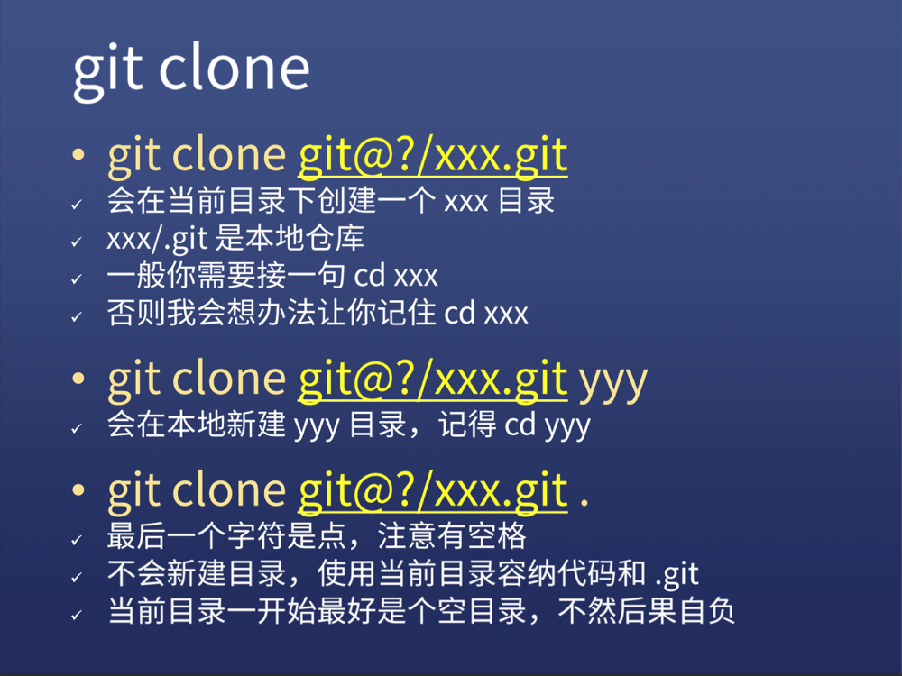

# Git教程笔记


## Git的6条初始配置

```sh
git config --global user.name 你的英文名
git config --global user.email 你的邮箱
git config --global push.default simple
git config --global core.quotepath false
git config --global core.editor "code --wait"
git config --global core.autocrlf input
```

​	分条解释及参考如下：

`git config --global user.name`设置name

`git config --global user.email`设置email

`git config --global push.default simple`	[git config --global push.default simple 的相关解读_黑夜人的博客-CSDN博客](https://blog.csdn.net/wulove52/article/details/52357006)

`git config --global core.quotepath false`	[git乱码解决方案汇总 - 灵聚 - 博客园 (cnblogs.com)](https://www.cnblogs.com/perseus/archive/2012/11/21/2781074.html)

`git config --global core.editor "code --wait"`	[git config --global core.editor的理解_只想整天学习-CSDN博客](https://blog.csdn.net/zZzZzZ__/article/details/98769284)

`git config --global core.autocrlf input`	[git core.autocrlf配置说明_xuewuzhijin2012的专栏-CSDN博客_core.autocrlf](https://blog.csdn.net/xuewuzhijin2012/article/details/50117181)

**设置完毕之后可以使用`git config --global --list`查看设置情况**

## 开始使用

`git init`  初始化生成.git目录

`git add 路径` 标记那些变动是需要提交的，相对以及绝对路径均可，以及.和*

+ 当被跟踪的文件里面有不想跟踪的文件时，可以使用命令git rm删除文件或者跟踪，使用方法如下：

  + `git rm --cached readme1.txt `   删除readme1.txt的跟踪，并保留在本地。

  + `git rm --f readme1.txt`    删除readme1.txt的跟踪，并且删除本地文件。

.gitignore文件用于标记哪些变动是不需要提交的

`git commit -m 字符串` 提交，字符串为理由，字符串里面如果有空格，最好用引号包起来

**另外一种更加推荐方式是`git commit -v` 可以添加更详细的信息**

`git log` 只显示之前的提交

**`git reflog` 可以显示所有的提交以及回退的操作**

`git reset --hard XXXXXX` XXXXXX是提交号的前六位，该指令可以回退版本，回退之前务必保证目前进度已经commit 

`git branch xxx`   基于当前的commit创建一个新的分支

`git checkout` 用于切换到另外一个分支

`git merge` 合并分支，合并可能会出现冲突

+ 发现冲突
  + 冲突时会有conflict提示
  + **使用`git status -sb` 命令查看冲突出现的位置**
+ 解决冲突
  + 打开文件寻找====，对比保留需要的文件
  + 删除不用的代码，包括=== >>> <<<<这些
  + **git add 再次添加对应文件**
  + **再次使用`git status -sb` 命令查看冲突出现的位置**
  + 没有冲突之后直接使用`git commit` **注意不需要选项**

`git branch -d xxx` 该命令用于删除分支

## Github远程操作

* 结合官方文档设置SSH
* 建立一个repo
* `git remote add origin git@XXXX` 在本地仓库添加远程仓库地址，Origin是远程仓库的默认名称，可以改但是没必要，自己的仓库使用SSH不使用HTTP会方便一点
* `git push -u origin master` 推送本地maste分支到远程origin的master分支，-u只在初次设置时使用，以后可以直接使用`git push ` `git pull`
* 复制代码使用`git clone git@XXX.git`  
  * 

## 使用bash alisa简化命令

```bash
touch ~/.bashrc
echo 'alias ga="git add"'>> ~/.bashrc
echo 'alias gc="git commit -v"'>> ~/.bashrc
echo 'alias gl="git pull"'>> ~/.bashrc
echo 'alias gp="git push"'>> ~/.bashrc
echo 'alias gco="git checkout"'>> ~/.bashrc
echo 'alias gst="git status -sb"'>> ~/.bashrc

```

最后 code ~/.bashrc 在文件最后加上

```bash
alias glog="git log --graph --pretty=format:'%Cred%h%Creset -%C(yellow)%d%Creset %s %Cgreen(%cr) %C(bold blue)<%an>%Creset' --abbrev-commit -- | less"
source ~/.bashrc				 			 			 			 			 			 			 			 			 			 			 			 			 			 			 			 			 			 			 			 		
```

## 其他一些记录的问题

* ZSH默认不显示GIT分支，安装ohmyzsh可解决，[Home · ohmyzsh/ohmyzsh Wiki (github.com)](https://github.com/ohmyzsh/ohmyzsh/wiki)

