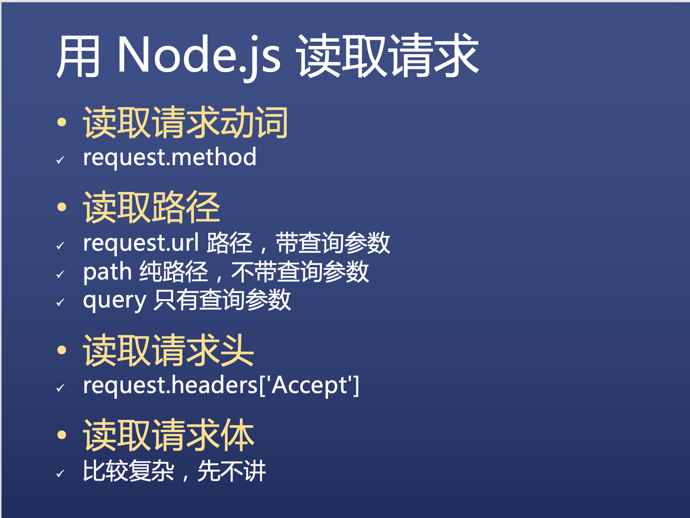
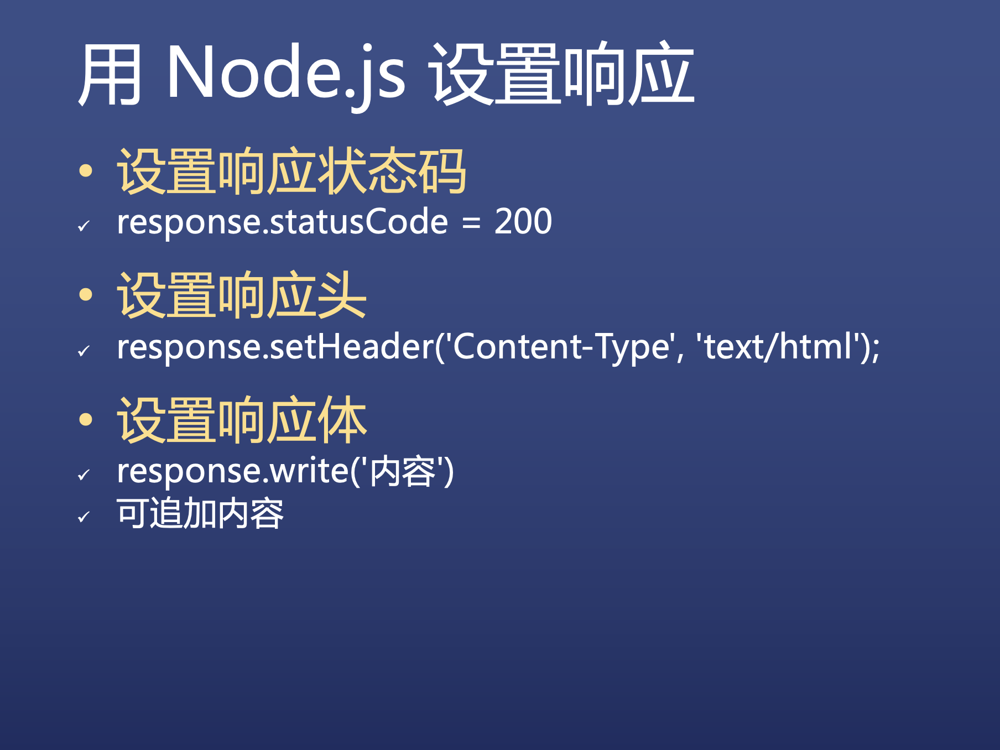

* 服务器端代码部分逻辑

  * 每次收到请求都会把中间的代码执行一遍

  * 用 if else 判断路径，并返回响应

  * 如果是已知路径，一律返回 200

  * 如果是未知路径，一律返回 404

  * **Content-Type 表示内容的「类型/语法」,与路径里面的无关**

  * response.write() 可以填写返回的内容

  * response.end() 表示响应可以发给用户了

## HTTP请求与相应基础

* 请求

  * **请求动词 路径加请求参数 协议名/版本**
  * HOST：域名或者IP
  * User Agent：用户代理（User Agent）就是帮你发送请求的工具，使用浏览器时浏览器就是用户代理，使用curl时curl就是用户代理
  * Accept：text/html，表示接受什么内容
  * **content-type：请求体的格式**
  * 回车
  * 请求体

  * 细节问题
    * 三部分：请求行（第一行），请求头（第二到第五行 ），请求体
    * 请求动词有：GET/POST/PUT/DELETE/PATCH等
    * 请求体一般在GET请求中为空
    * 文档查阅 RFC2616第五章

* 响应

  * **协议名/版本 状态码 状态字符串**
  * **content-type：响应体的格式**
  * 回车
  * 响应体
  * 细节问题
    * 三部分 状态行，响应头，响应体
    * 常见状态码是面试常问的问题
    * 文档查阅 RFC2616第六章

## CURL构造HTTP请求

* 以上内容使用`curl -v www.baidu.com`就可以对照找出相应内容

* 设置请求动词

  * -X POST
  * 注意大小写

* 设置路径和参数

  * 直接在URL后面写

* 设置请求头

  * -H 'Name:Value' or --header 'Name:Value'

* 设置请求体

  * -d 'content' or --data 'content'

  

  

