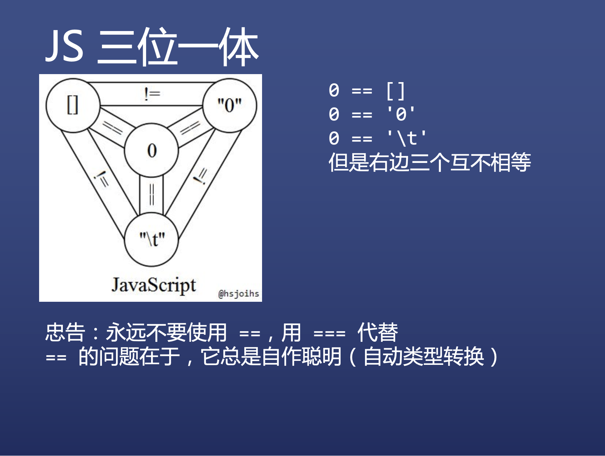

## 算术运算符

* number 运算
  * 加减乘除
  * 余数 x % 7
  * 指数 x ** 3
  * 自增自减 x++ / ++x / x-- / --x
  * 求值运算符 +x
  * 负数运算符 -x
* string 运算
  * 连接运算 '123' + '456'

##  比较运算符

* \\
* <
* =
* <=
* ==
* !=
* ===
* !==

## 布尔运算符

* 或且非
  * ||
  * &&
  * !
* 短路逻辑
  * console && console.log && console.log('hi')
  * 以防 console 不存在报错
  * a = a || 100
  * a 的保底值

## 二进制运算符

* 或、与、否
  * 两个位都为0，则结果为0，否则为1
  * &
  * ~
    * **一个数与自身的取反值相加等于-1**
* 异或
  * ^
  * 两个位相同，则结果为0，否则为1

* 左移右移
  * << 和 >>
* 头部补零的右移运算符
  * \>>>
* 详情参考[位运算符在JS中的妙用 - 掘金 (juejin.cn)](https://juejin.cn/post/6844903568906911752)

* 面试问题

  * 使用与运算符判断奇偶
    * 偶数 & 1 == 0 
    * 奇数 & 1 == 1
  * 使用~, >>, <<, >>>, |来取整
    * console.log(~~ 6.83)  // 6
    * console.log(6.83 >> 0) // 6
    * console.log(6.83 << 0) // 6
    * console.log(6.83 | 0)  // 6
    * console.log(6.83 >>> 0)  // 6

  * 使用^来交换 a b 的值

    * var a = 5

      var b = 8

      a ^= b

      b ^= a

      a ^= b

      console.log(a)  // 8

      console.log(b)  // 5

    * 其实使用结构赋值更好，[a,b]=[b,a]

  ## 点运算符

  * 语法
    * 对象.属性名 = 属性值
  * 作用
    * 读取对象的属性值
  * 有个疑问
  * 不是对象，为什么也可以有属性？'a-b-c'.split('-')
  * JS 有特殊逻辑，点前面不是对象，就把它封装成对象
  * number 会变成 Number 对象
  * string 会变成 String 对象
  * bool 会变成 Boolean 对象
  * 程序员从来不用这三种对象，只用简单类型

  ## void 运算符 

  * 语法
    * void 表达式或语句
  * 作用
    * 求表达式的值，或执行语句
    * 然后 void 的值总是为 undefined
  * 需求
    * \<a href="http://example.com" onclick="f(); return false;">点击\</a>
    * return 假值可以阻止默认动作
    * \<a href="javascript: void(f())">文字\</a>
    * 改用 void 可以炫技

##  逗号运算符

* 语法
  * 表达式1, 表达式2, ..., 表达式n
* 作用
  * 将表达式 n 的值作为整体的值
* 使用
  * let a = (1,2,3,4,5)
  * 那么 a 的值就是 5，奇葩吧？
  * let f = (x) => (console.log('平方值为'), x*x)
  * 注意上面的括号不能省

## 运算符优先级

见此篇 [运算符优先级 - JavaScript | MDN (mozilla.org)](https://developer.mozilla.org/zh-CN/docs/Web/JavaScript/Reference/Operators/Operator_Precedence#table)

