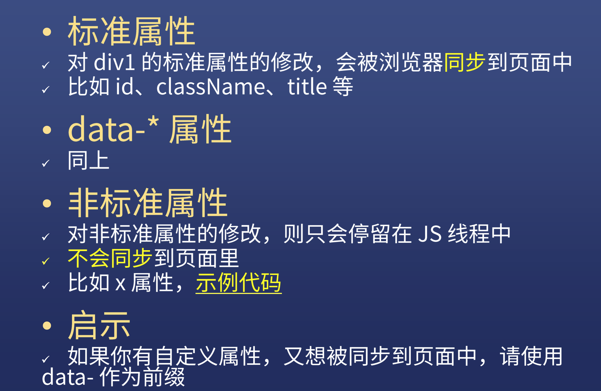
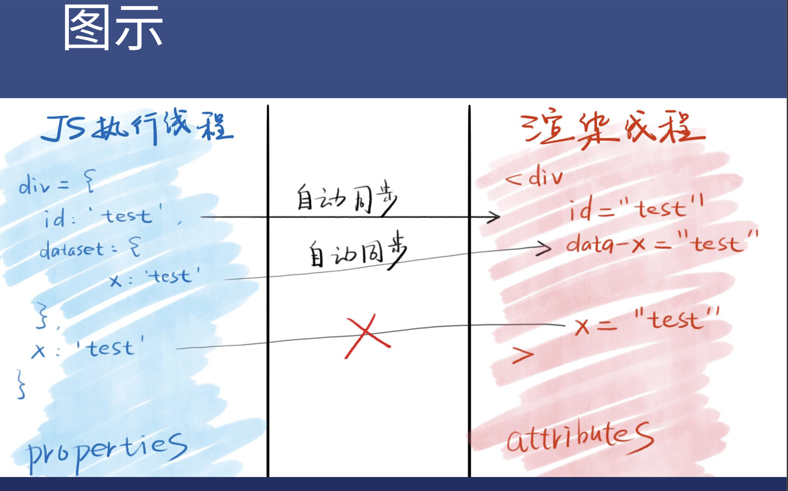
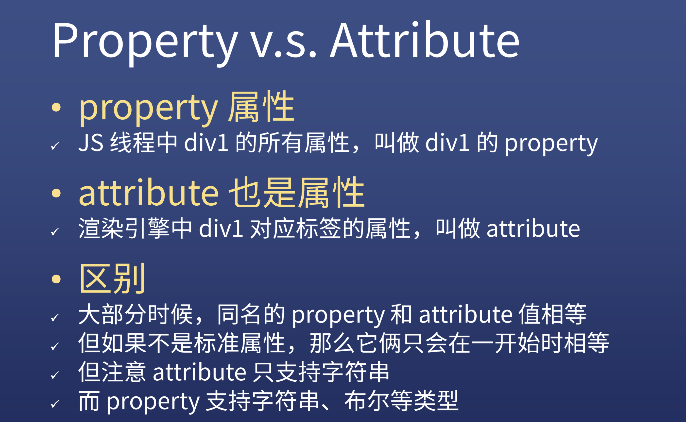

* 获取元素
  * window.id或者直接用id就可以（前提为id未被使用）
  * document.getElementByid('id')
  * document.getElementsbyTagname('div')[0]
  * document.getElemenstbyClassName('red')[0]
  * document.querySelector('#id')
  * Document.querySelectorAll('.red')[0]
  * 几个特殊情况
    * 获取html元素
      * document.documentElement
    * 获取head元素
      * document.head
    * 获取body元素
      * document.body
    * 获取窗口（窗口不是元素）
      * window
    * 获取所有元素
      * document.all(**document.all是第六个falsy值**)

* 元素的6层原型链

  .png)

## 元素的增删改查

* 增
  * 创建一个标签节点
    * let div1 = document.createElement('div')
  * 创建一个文本节点
    * text1 = document.createTextNode('你好')
  * 标签里面插入文本
    * div.appendchild(text1)
    * Div.innerText = 'hello'或div1.textContent= 'hello'
    * **但是不能用div.appendchild('你好')** 
  * 插入页面之中
    * Document.body.appendchild(div)
    * 已在页面中的元素.append(div)
    * **一个元素不能放在两个地方，除非复制（cloneNode）一份**
* 删
  * childNode.remove()
* 改
  * 改class：div.className = 'red' //会覆盖
  * 改class：div.classList.add('red')
  * 改style：div.style = "width:100px;color:red;"
  * 改style的一部分：div.style.width = '200px'
  * 注意大小写：div.style.backgroundColor='red'
  * **改data-*属性：div.dataset.x='frank'**
  * 读属性
    * div.classList/a.herf(**直接使用可能会获取到被浏览器加工的值，**)
    * div.getAttribute('class')/a.getAttribute('herf')
  * 改事件处理函数
    * div.onclick默认为null
    * 设置div.onclick=fn()是这样调用的fn.call(div,evt)，也就是**说this是被设置为div**，evt是事件函数
    * div.addEventListener
  * 改内容
    * div.innerText = 'xxx'
    * Div.textContent='xxx'
    * 都是一样的，我一般用innerText
  * 改html内容
    * div.innerHTML=''
  * 改标签
    * div.innerHTML=''//先清空
    * div.appendChild(div2)//再加内容
* 查
  * 父级元素
    * node.parentNode或者node.parentElement
    * Node.parentNode.parentNode
  * 子级元素
    * node.childNodes或者node.children
  * 查同级元素
    * node.parentNode.childNodes(需要另外排除自己)
    * node.parentNode.children(需要另外排除自己)
  * 查第一个元素
    * node.firstchild
  * 查看最后一个元素
    * node.lastchild
  * 查看上一个节点/元素
    * node.previousSibing/node.previousElementsibing
  * 查看下一个节点/元素
    * node.nextSibing/node.nextElementsibing

## DOM操作是跨线程的

浏览器有JS引擎和渲染引擎，JS不能操作页面，只能操作JS，反之渲染引擎也只能操作页面，不能操作页面

关于为什么操作DOM慢可以再看一下下面的文章：

[为什么说DOM操作很慢 - SegmentFault 思否](https://segmentfault.com/a/1190000004114594)

[javascript - But why's the browser DOM still so slow after 10 years of effort? - Stack Overflow](https://stackoverflow.com/questions/6817093/but-whys-the-browser-dom-still-so-slow-after-10-years-of-effort)