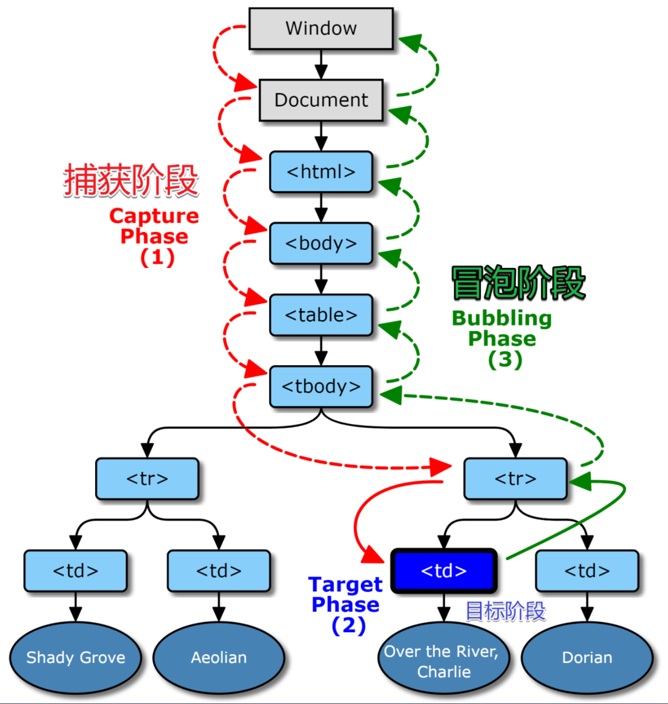
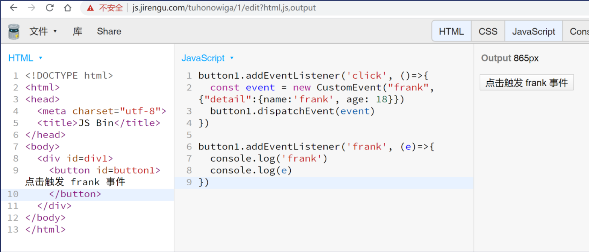

##  DOM事件模型

这里所说的DOM事件模型指的是DOM Level 2模式，它属于W3C标准模型，现代浏览器都支持该模型。在该事件模型中，一次事件共有三个过程：

* **事件捕获阶段（Capturing Phase）**：事件从 document 一直向下传播到目标元素，依次检查经历过的节点是否绑定了事处监听函数（事件处理程序），如果有则执行，反之不执行

* **事件处理阶段（Target Phase）**：事件到达目标元素，触发目标元素的监听函数

* **事件冒泡阶段（Bubbling Phase）**：事件从目标元素冒泡到 document，依次检查经过的节点是否绑定了事件监听函数，如果有则执行，反之不执行。

简而言之：事件一开始从文档的根节点流向目标对象（捕获阶段），然后在目标对向上被触发（目标阶段），之后再回溯到文档的根节点（冒泡阶段）。



* 要注册事件，必须使用`addEventListener('click',fn,bool)`方法。
  * 如果bool不填或者为falsy，则事件在冒泡阶段执行
  * 如果bool为true，则在事件在捕获阶段进行
  * 注意，不能在什么阶段进行，捕获和冒泡这个流程都是有的

案例[饥人谷JS Bin (jirengu.com)](http://js.jirengu.com/wulagitizi/1/edit)

注意，evt事件在事件结束后就会被浏览器改变，如果想要再使用evt里的currentTarget，可以参考上面这个案例使用变量将引用复制下来。

##  targt VS currentTarget

* e.target是用户操作的元素
* e.currenttarget是监听的元素
* this是e.currentTarget

* 一个特例
  * 只有一个DIV被监听（不考虑父子同时被监听）
  * fn分别在捕获阶段和冒泡阶段监听click事件
  * 用户点击的元素就是开发者监听的
  * 那么**谁先监听谁先执行**

## 阻止冒泡与默认行为

* 捕获不可以取消，但是冒泡可以，使用**e.stopPropagation()**可以阻止冒泡

* 阻止默认行为使用**e.preventDefault()**，可以使用MDN查阅事件是否冒泡（Bubbles）以及是否能取消默认行为（Cancelable），是否能取消默认行为与冒泡无关

这里就有一个问题，查阅scroll的MDN页面我们可以知道，scroll是不能取消默认行为的，因为是先滚动后触发的，那我们如何阻止滚动呢？

* 首先我们可以阻止鼠标滚轮（wheel）和触摸（touchstart）的默认行为来实现，但是直接拖动滚动条还是可以滚动
* 那我们可以使用CSS直接使滚动条width为0(代码为`::webkit-scrollbar{width:0!important}`）就可以了

## 自定义事件

浏览器事件是很多的，共有100多种，可以参考MDN进行查看[事件参考 | MDN (mozilla.org)](https://developer.mozilla.org/zh-CN/docs/Web/Events)

* 鼠标经过的四个事件特征需要记一下：[JavaScript里mouseenter和mouseleave与mouseover和mouseout的区别 - xplblog - 博客园 (cnblogs.com)](https://www.cnblogs.com/xpl-blogs/p/6528012.html)

当然我们也可以自定义一个事件，示例如下：



## 事件委托

* 定义：
  * 利用事件冒泡的特性，将本应该注册在子元素上的处理事件注册在父元素上，这样点击子元素时发现其本身没有相应事件就到父元素上寻找作出相应。
* 优点：
  * 节省监听数，减少内存消耗，提高性能
  * 随时可以添加子元素，添加的子元素会自动有相应的处理事件，也就是可以监听动态元素

封装一个事件委托函数

```js
  function on(eventType,element,selecton,fn){
              if(element instanceof Element){
                element = document.querySelector(element)
              }
              element.addEventListener(eventType,(e)=> {
                const t = e.target
                 if(t.matches(selector)){
                    fn(e)
                    }
              })
            }
```

这个函数在matchers这段是存在问题的，因为用户点击的元素可能与selector不一致，这时我们需要使用递归判断一下target的父级元素，可以参考这里进行修改[wheels/index.js at master · FrankFang/wheels (github.com)](https://github.com/FrankFang/wheels/blob/master/lib/dom/index.js#L2)

```js
function on(element, eventType, selector, fn) {
    element.addEventListener(eventType, e => {
      let el = e.target
      while (!el.matches(selector)) {
        if (element === el) {
          el = null
          break
        }
        el = el.parentNode
      }
      el && fn.call(el, e, el)
    })
  }
```

最后一个问题，JS支持事件吗？

实际上以上所说的DOM事件并非JS的功能，而是属于浏览器提供的DOM的功能，浏览器只是调用DOM提供的addEventListener而已。

