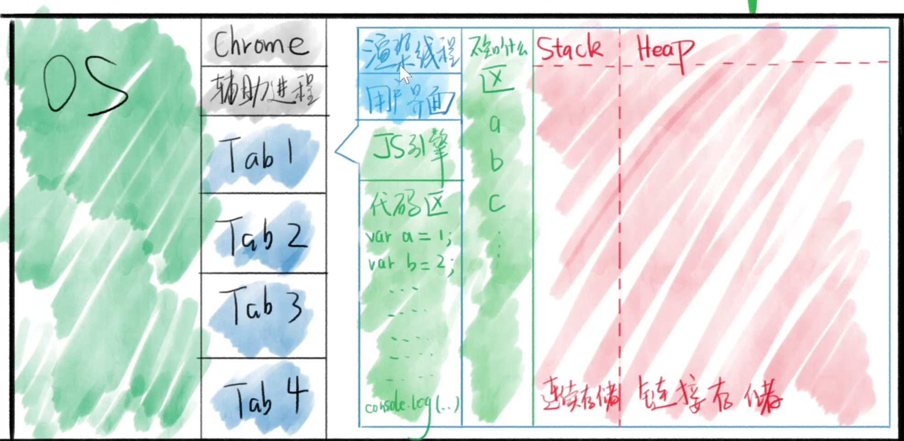
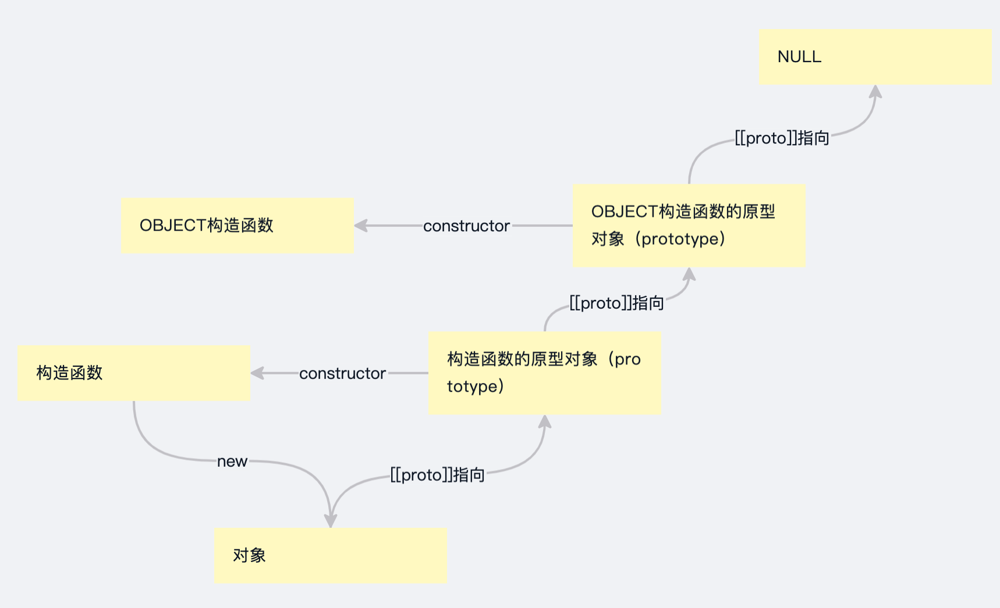

## 内存图与JS世界

### 浏览器的功能：

* 发起请求，下载HTML，解析HTML，下载CSS，解析CSS，**渲染界面**，下载JS，解析JS，执行JS等
* 功能模块：用户模块，**渲染引擎**，**JS引擎**等
* 上述功能模块处于不同的**线程**，**线程**比**进程**更小一级

### JS引擎

> Chrome和Nodejs使用的是V8引擎，C++编写

* 主要功能
  * 编译：编译JS代码，把JS翻译成字节码或者机器码
  * 优化：改写代码，使其更高效
  * 执行：执行上面的字节码或者机器码
  * 垃圾回收：内存回收

### 执行过程

准备工作

* （浏览器）提供API：window / document / setTimeout

* 这些都不是Js提供的，而是浏览器提供的

* 我们把这些功能称为运行环境（runtime env）

* 一旦JS放入页面，就开始执行JS

* 内存分配

  > 
  >
  > 
  >
  > 数据分为两种：对象和非对象
  >
  > 非对象存在栈，对象存在堆里面
  >
  > =总是会把右边的值复制给左边（所以这里不存在什么按值传递和按地址传递）

## 原型链

很熟悉了，直接上图

