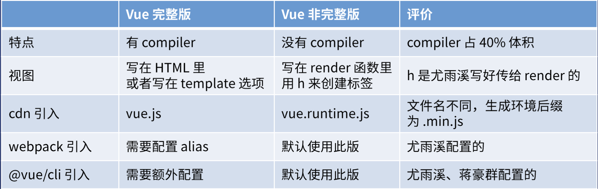

## 完整版 VS 非完整版

Vue可以分为两个版本：完整版和非完整版，使用比如[BootCDN](https://www.bootcdn.cn/vue/)进行引入时可以对比后缀名，带runtime的就是非完整版，反之不带的就是完整版，比如：

* `<script src="https://cdn.bootcdn.net/ajax/libs/vue/2.6.9/vue.js"></script>` 这是引入了一个完整版
* `<script src="https://cdn.bootcdn.net/ajax/libs/vue/2.6.9/vue.runtime.js"></script>`  这是引入了一个非完整版（runtime版）

他们之间的区别可以参考下表进行对比：

可以看出，他们的主要区别是是否带有`complier`,因此决定将视图的html写在哪，如果使用完整版，那就可以把操作元素写在html或者是Vue实例的template里面，如果使用runtime版本，前面的方式就行不通了，只能写在实例的render函数里用h来创建标签，或者写在vue单文件的template标签内，这时候就会使用`vue-loader`来把vue文件的html转成h函数。

所以一般会倾向于选择非完整版，原因如下：

1. 保证用户体验，用户下载的JS文件体积更小，虽然**只支持h函数**。
2. 保证开发体验，开发者可直接在vue文件里写HTML标签，而**不写 h函数**。
3. 脏活让loader做，**vue-loader 把vue文件里的HTML转为h函数**。

非完整版也是有一个缺点的，即可能造成SEO不友好，对应的优化方式就是把title、description、keyword、h1、a 提前写入页面，让搜索引擎能够看到即可。

##  template与render的使用

1.完整版template, 引入vue.js

```js
new window.Vue({
    el: "#app",
    template: `
    <div @click="add">
      {{n}}
      <button> +1 </button>
    </div>
  `,
    data: {
        n: 0,
    },
    methods: {
        add() {
            this.n += 1;
        },
    },
});
```

2.非完整版render, 引入vue.runtime.js运行时版本
使用vue-cli创建的目录默认会使用这个vue.runtime.js

用来创建 Vue 实例、渲染并处理虚拟 DOM 等的代码。基本上就是除去编译器的其它一切。
这种方式不能直接从HTML页面里面获取数据，需要使用 render 函数

```js
new window.Vue({
  el: "#app",
  render(h){// vue 会给 render 传一个参数这个参数是一个可以创建html的函数
    return h("div", [this.n, h("button", {on:{click: this.add}}, "+1")])
  },
  data: {
    n: 0
  },
  methods:{
    add(){
      this.n += 1
    }
  }
})

```

这种方式更加的灵活独立，因为运行时版本相比完整版体积要小大约 30%，这样用户在使用产品时就会效果更好，所以应该尽可能使用这个版本。
但是这种使用 render 函数的方式显得很麻烦,因此 webpack 提供了 vue-loader
当使用 vue-loader 或 vueify 的时候，*.vue 文件内部的模板会在构建时预编译成 JavaScript。你在最终打好的包里实际上是不需要编译器的，所以只用运行时版本即可。

vue-loader 可以把 html模板编译成 render函数的js代码，这样在我们最后build的时候就会产生一个运行时的版本，从而使体积最小

只需要写成.vue文件

```js
//  demo.vue
<template>
  <div class="red">
    {{ n }}}
    <button @click="add">+1</button>
  </div>
</template>

<script>
export default {
  data(){
    return {
      n:0
    }
  },
  methods:{
    add(){
      this.n++
    }
  }
}
</script>

<style scoped>
  .red{
    color: red;
  }
</style>

```

vue-loader 会把这个demo.vue文件变成一个对象 使用render函数渲染这个对象即可

```js
new Vue({ 
  el:'#app',
  render(h) {     
    return  h(demo)
  },
})
```

## 利用codesandbox快速创建Vue

1.打开[CodeSandbox: Online Code Editor and IDE for Rapid Web Development](https://codesandbox.io/)，建议不登陆使用（登陆后会有限制）

2.点击create Sandbox选择Vue

3.需要导出文件直接点击下载即可,选择Export to ZIP