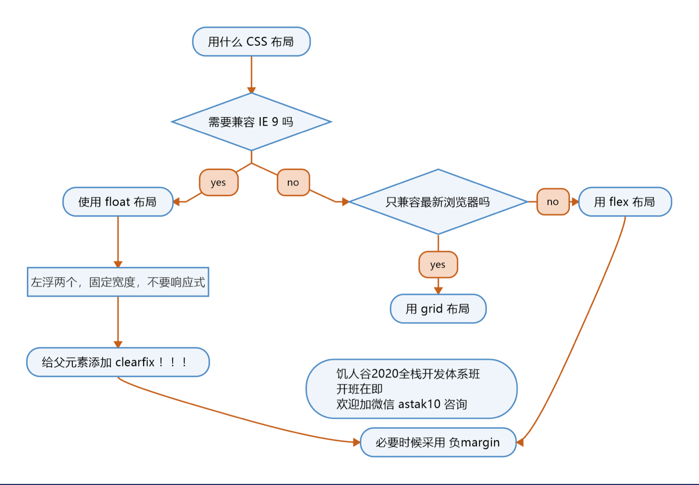

## 何为布局

把页面分成一块块的，按左中右，上中下等排列

* 两种
  * 固定宽度布局，一般宽度为960/1000/1024px
  * 不固定宽度布局，主要靠文档流的原理来布局
* 第三种布局
  * 响应式布局
  * PC上固定宽度，手机上不固定宽度
  * 也就是一种混合布局
* 布局思路
  * 从大到小
  * 从小到大

## 选择布局方式



* float布局

  * 步骤

    * 子元素添加float标签
    * **父元素清除浮动，加上.clearfix**

    ~~~css
            .clearfix:after {
                content: '';
                display: block;
                clear: both;
            }
    ~~~

  * 经验

    * 有经验的人会留一些空间，或者最后一个不设width
    * **不需要做响应式，此布局方法是为IE准备的**
    * 此方法在IE6/7上有双倍margin的BUG
      * 解决方法1:针对浏览器将margin减半，margin后面加一句_margin=xxx覆盖之前设置的
      * 加一句display：inline-block

  * 在float平均布局中会遇到容器盒子宽度不够导致溢出的问题，这时候可以使用**负margin法**来进行解决，具体方法可以解释为再加一层盒子嵌套，然后在该盒子上把对应的margin设为负值

* flex布局

  * container

    * 把一个元素变成flex布局：

      * `display:flex`
      * `display:inlineflex`

    * 改变items流动方向（主轴）

      * ```css
        .container {
        	flex-direction: row | row-reverse | column | column-reverse
        }
        ```

      * 默认为 row

    * 改变折行

      * ```css
        .container {
        flex-wrap: nowrap | wrap | wrap-reverse
        }
        ```

      * 默认为no-wrap

    * 主轴对齐方式

      * ```CSS
        .container {
          justify-content:flex-start | flex-end | center | space-between | space-around | space-evenly 
        }
        ```

      * 默认主轴为横轴（flex：row）

    * 次轴对齐方式

      * ```css
        .container {
          allign-items: flex-start | flex-end | center | stretch | baseline
        }
        ```

      * 默认为 stretch

    * 多行内容

      * ```css
        .container {
          align-content: flex-start | flex-end
        }
        ```

  * Item

    * order

      设置流动次序，会按照自然数排列

    * flex-grow

      控制如何“长胖”，默认为0

    * Flex-shrink

      控制如何“变瘦”，**默认为1**，一般设为0防止变瘦

    * flex-basis

      控制基本宽度，默认为auto，较少使用

    * flex

      以上的缩写，格式为flex:flex-grow flex-shrink flex-basis

    * Align-self

      设置独立的对齐方式，填入值与align-items相同；

  * 一些其它技巧

    * 平均布局时还是要使用-margin法解决被挤出去的问题
    * 在一些情况下可以不使用justify- content：space- between进行，可以改用margin：auto的方法来，这个方法相对更加灵活一点。

* grid布局

  一维布局用flex，二维布局用gird

  * 