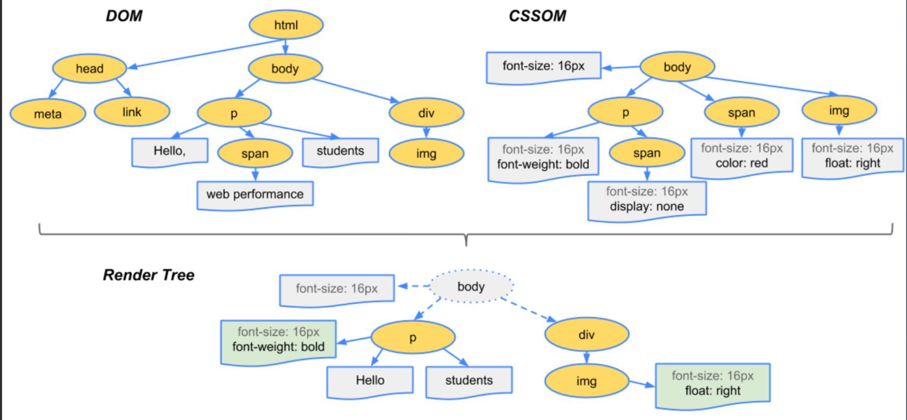
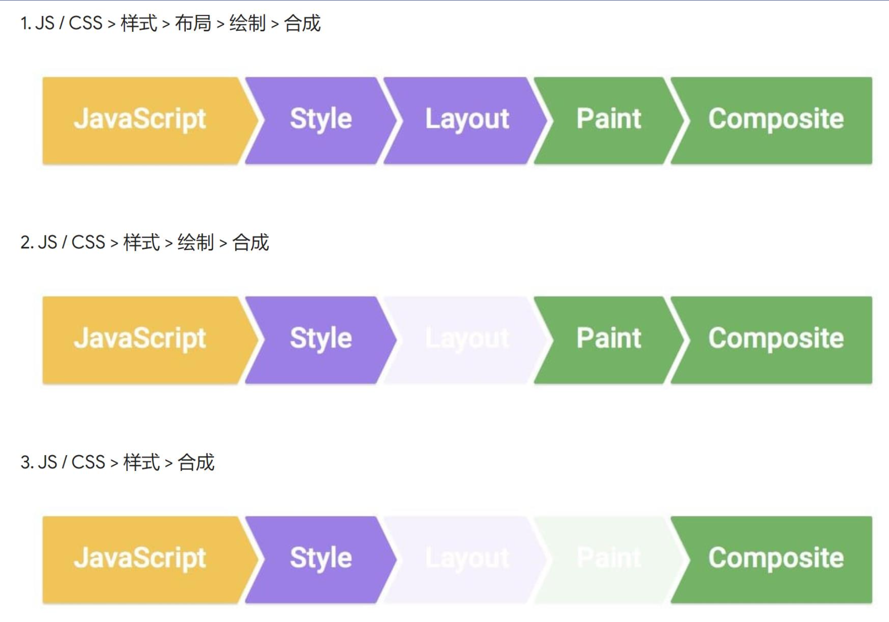
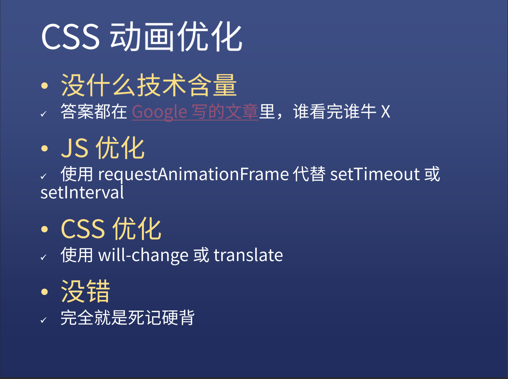
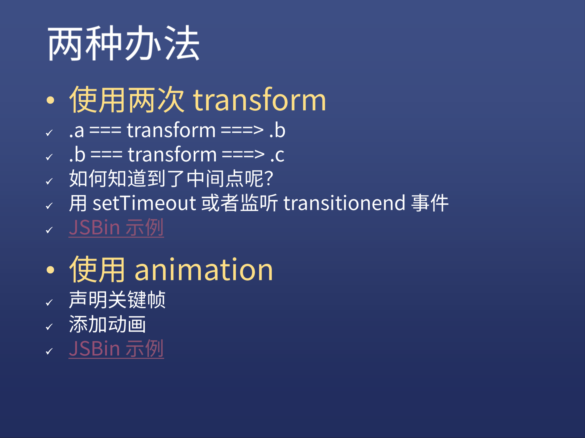

## 浏览器渲染过程

* 根据HTML构筑HTML树（DOM）

* 根据CSS构筑CSS树（CSSDOM）

* 将两棵树合并成一棵渲染树（render tree）

  

* LAYOUT布局（文档流、盒模型、计算大小和位置）

* paint绘制（把边框颜色、文字颜色、阴影等画出来）

* composite合成（根据层叠关系展示画面）

* 三种更新方式

  

  1. 例如div.remove()全部走一遍

  2. 改变background，没有layout一步

  3. **transform只需要composite，不需要reflow和repaint，所以相对来说在性能上更优**

     reflow在布局发生变化之后进行，而repaint仅在例如背景颜色和边框颜色等没有发生布局变化的情况下进行，优化reflow和repaint可以GOOGLE。

  4. 每个属性都触发什么渲染流程可以参考此网站：[CSS Triggers](https://csstriggers.com/)

  5. 关于CSS动画的优化，详见：[坚持仅合成器的属性和管理层计数  | Web  | Google Developers](https://developers.google.com/web/fundamentals/performance/rendering/stick-to-compositor-only-properties-and-manage-layer-count#管理层并避免层数激增)
  
     

## transform

inline元素不支持transform，需要先转成block，具体语法可以直接看MDN：[transform - CSS（层叠样式表） | MDN (mozilla.org)](https://developer.mozilla.org/zh-CN/docs/Web/CSS/transform)

* translate 位移
  * 绝对定位和translate(-50%,-50%)配合使用可以实现元素的居中
* scale 缩放
* rotate 旋转
* skew 倾斜

## transition

过渡，补充中间帧

* transition:属性 时长 过渡方式 延迟

* 多个属性用逗号隔开

* all表示所有属性

* 过渡方式有很多，默认是ease，具体查MDN

* 注意点

  * 并非所有属性都可以过渡，比如display：none=>block就不能过渡，可以使用visibility：hidden=>visible,关于这两者的区别就是display：none的元素从文档流中消失了，而visibility：hidden则是文档流中保留原占据空间，知识看不见了
  * 颜色和透明度都是可以过渡的
  * 过渡必须要有起始状态和结束状态

* 如果有两次过渡怎么办？

  

## animation

* Animation语法 

  详见 [animation - CSS（层叠样式表） | MDN (mozilla.org)](https://developer.mozilla.org/zh-CN/docs/Web/CSS/animation)

  * anmition：时长｜过渡方式｜延迟｜次数｜方向｜填充方式｜是否暂停｜动画名
  * 属性次序不是固定的
  * 动画结束后停在最后一帧可以将填充模式设置为forwards即可
  * 无限回环动画可以将属性设置为 alternate infinite

* @keyframes 

  详见 [@keyframes - CSS（层叠样式表） | MDN (mozilla.org)](https://developer.mozilla.org/zh-CN/docs/Web/CSS/@keyframes)

  * @keyframes XXX { }
  * 可以使用from to或者是百分比

本次实践写在 [饥人谷JS Bin (jirengu.com)](http://js.jirengu.com/mihunawoci/5/edit)

